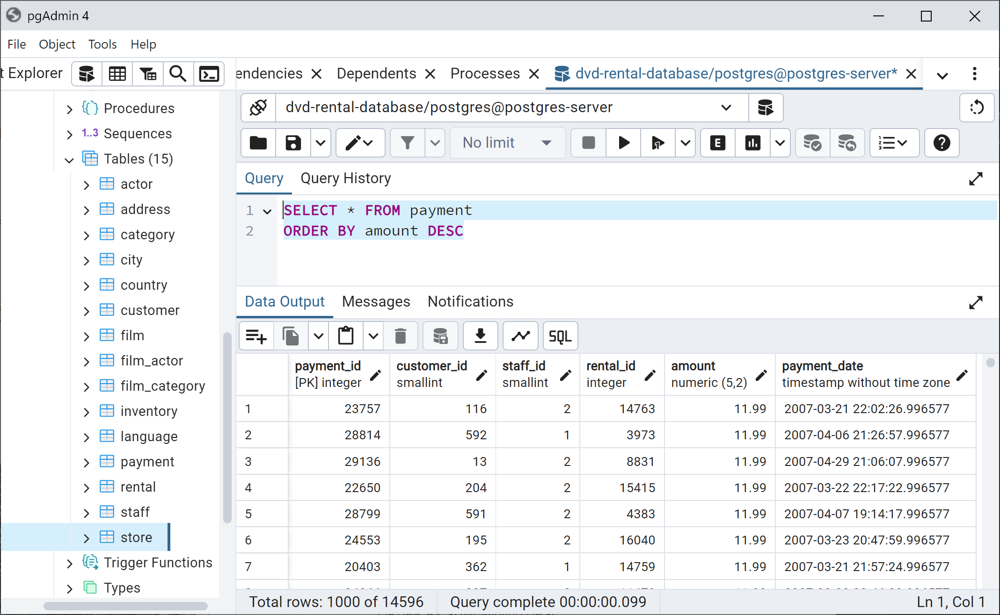
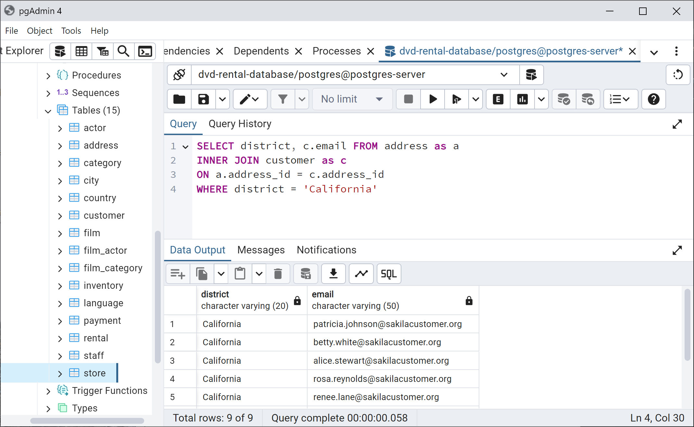

# Learning Pro SQL
Learn Pro SQL using PostgreSQL through pgAdmin
Following helped me built this guide:
1. Jose Portilla Udemy Course [The Complete SQL Bootcamp: Go from Zero to Hero](https://www.udemy.com/course/the-complete-sql-bootcamp)

## Table of Contents
1. [Installation](#installation)
2. [Populate Database](#populate-database)
3. [SQL Commands And Keywords](#sql-commands-and-keywords)

## Installation
1. Go to the following link to download the PostgreSQL

    `https://www.enterprisedb.com/downloads/postgres-postgresql-downloads`

    Note: Remember the password you set for the PostgreSQL superuser (postgres).

2. If you need to install the pgAdmin, you may use following link

    `https://www.pgadmin.org/download/`

3. Open pgAdmin and you may need to enter password for pgAdmin for the first time.

4. Then connect with PostgreSQL server by entering postgres password.


## Populate Database
Here we going to restore an existing data base and learn SQL through it.
1. Create an empty database


2. Restore Database using dvdrental.tar file, which is folder databases.


3. Rename Database by going into properties, which can be accessed through right click on the Database name.


4. Opening Query Tool


## SQL Commands And Keywords
Performing commands on dvd rental database.

#### SELECT
Selecting all the rows from table payment.

```
SELECT * FROM payment;
```


#### WHERE
Selecting all the rows, where amount is greater than 3.

```
SELECT * FROM payment
WHERE amount > 3;
```


#### COUNT
Counting all the rows of the payment table.

```
SELECT COUNT(*) FROM payment;
```


#### LIKE
Selecting all the rows from table actor, where the first_name starts from 'P'.

```
SELECT * FROM actor
WHERE first_name LIKE 'P%';
```


Counting all the films with title containing 'Truman'

```
SELECT COUNT(*) FROM film
WHERE title LIKE '%Truman%';
```


#### ILIKE
ILIKE is case insensitive version of LIKE.

Selecting all the rows of table film, where description has a case insensitive word 'robot' in it. ('roBot' / 'Robot' / 'ROBOT' / 'RoBoT')

```
SELECT * FROM film
WHERE description ILIKE '%robot%';
```


#### DISTINCT
DISTINCT used the find different values.

Selecting distinct districts from address table.

```
SELECT DISTINCT(district) FROM address;
```


#### GROUP BY
Grouping of a column by applying aggregation functionality of other one.

```
SELECT staff_id, COUNT(*) FROM payment
GROUP BY staff_id
```


You may use different aggregation function e.g. COUNT, AVG, SUM, etc.

```
SELECT rating, ROUND(AVG(replacement_cost),2) FROM film
GROUP BY rating
```


#### HAVING
Used after GROUP BY to filter results.

Let's say we need to get customers who have done 40 or more payments/transactions.

```
SELECT customer_id, COUNT(*) FROM payment
GROUP BY customer_id
HAVING COUNT(*)>=40;
```

NOTE: It doesn't matter for keyword COUNT, which column is inserted. 


#### ORDER BY
Sorting of the data/rows by some column.

Let's say you want to order payments table by amount from max to low.

```
SELECT * FROM payment
ORDER BY amount DESC
```



You may order data by some new column generated through aggregation.

Let take an example in which you need to know which are top five customer w.r.t. amount of spending.

```
SELECT customer_id, SUM(amount) FROM payment
GROUP BY customer_id
ORDER BY SUM(amount) DESC
LIMIT 5
```


#### INNER JOIN - ON
The INNER JOIN takes the intersection of the two tables based on a specific columns. It returns all the columns of both tables. ON keyword is used with JOIN statements to tell on which condition the tables must be joined.

```
SELECT * FROM payment
INNER JOIN customer
ON payment.customer_id = customer.customer_id
```


You may use WHERE keyword to filter results of JOIN and also choose which column to return.

```
SELECT district, customer.email FROM address
INNER JOIN customer
ON address.address_id = customer.address_id
WHERE district = 'California'
```


You may also join multiple tables in a single query. 

```
SELECT
	TITLE,
	ACTOR.FIRST_NAME,
	ACTOR.LAST_NAME
FROM
	FILM
	INNER JOIN FILM_ACTOR ON FILM_ACTOR.FILM_ID = FILM.FILM_ID
	INNER JOIN ACTOR ON ACTOR.ACTOR_ID = FILM_ACTOR.ACTOR_ID
WHERE
	FIRST_NAME = 'Nick'
	AND LAST_NAME = 'Wahlberg'
```


#### AS
AS is used to rename column or table.

Let's see AS Keyword in action:

```
SELECT customer_id, amount AS amount_spent
FROM payment
```


AS keyword is also used to write clean query by aliasing the table name.

```
SELECT district, c.email FROM address as a
INNER JOIN customer as c
ON a.address_id = c.address_id
WHERE district = 'California'
```


NOTE: You can't use Aliased name for HAVING keyword


#### UNION
The UNION operator is used to combine the result-set of two or more SELECT statements. 

1. Every SELECT statement within UNION must have the same number of columns
2. The columns must also have similar data types
3. The columns in every SELECT statement must also be in the same order

We will be utilizing w3schools.com [example](https://www.w3schools.com/sql/sql_union.asp)


```
SELECT City FROM Customers
UNION
SELECT City FROM Suppliers
ORDER BY City;
```


