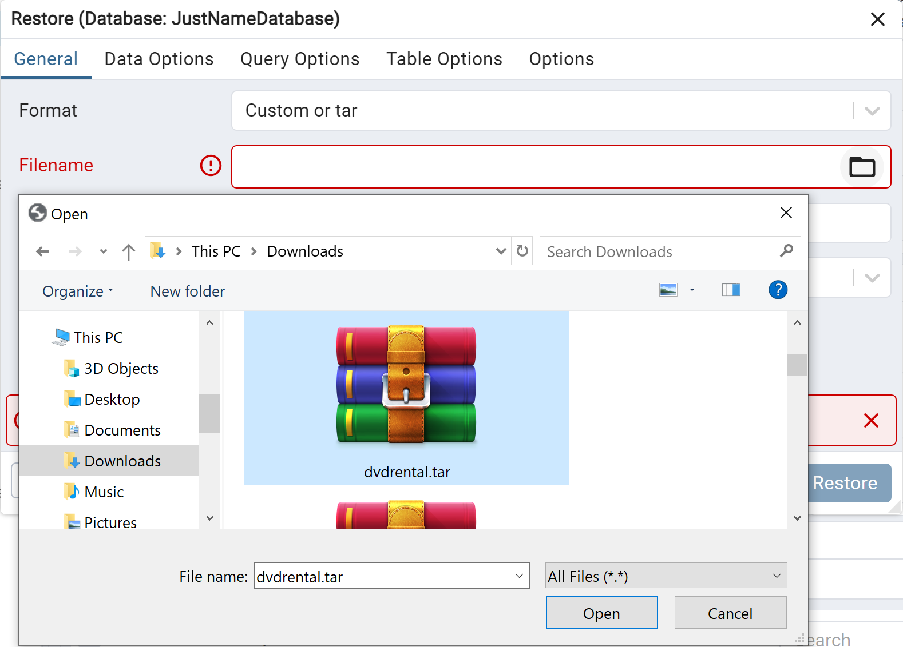

# Learning Pro SQL
Learn Pro SQL using PostgreSQL through pgAdmin
Following helped me built this guide:
1. Jose Portilla Udemy Course [The Complete SQL Bootcamp: Go from Zero to Hero](https://www.udemy.com/course/the-complete-sql-bootcamp)

## Installation:
1. Go to the following link to download the PostgreSQL

    `https://www.enterprisedb.com/downloads/postgres-postgresql-downloads`

    Note: Remember the password you set for the PostgreSQL superuser (postgres).

2. If you need to install the pgAdmin, you may use following link

    `https://www.pgadmin.org/download/`

3. Open pgAdmin and you may need to enter password for pgAdmin for the first time.

4. Then connect with PostgreSQL server by entering postgres password.

## Populate Database
Here we going to restore an existing data base and learn SQL through it.
1. Create an empty database

2. Restore Database using dvdrental.tar file, which is folder databases.

3. Rename Database by going into properties, which can be accessed through right click on the Database name.

