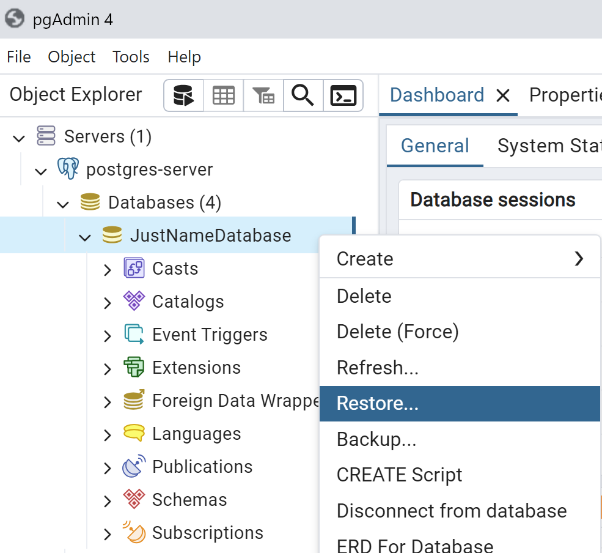

# Learning Pro SQL
Learn Pro SQL using PostgreSQL through pgAdmin
Following helped me built this guide:
1. Jose Portilla Udemy Course [The Complete SQL Bootcamp: Go from Zero to Hero](https://www.udemy.com/course/the-complete-sql-bootcamp)

## Table of Contents
1. [Installation](#installation)
2. [Populate Database](#populate-database)
3. [SQL Commands And Keywords](#sql-commands-and-keywords)

## Installation
1. Go to the following link to download the PostgreSQL

    `https://www.enterprisedb.com/downloads/postgres-postgresql-downloads`

    Note: Remember the password you set for the PostgreSQL superuser (postgres).

2. If you need to install the pgAdmin, you may use following link

    `https://www.pgadmin.org/download/`

3. Open pgAdmin and you may need to enter password for pgAdmin for the first time.

4. Then connect with PostgreSQL server by entering postgres password.


## Populate Database
Here we going to restore an existing data base and learn SQL through it.
1. Create an empty database


2. Restore Database using dvdrental.tar file, which is folder databases.



3. Rename Database by going into properties, which can be accessed through right click on the Database name.


4. Opening Query Tool


## SQL Commands And Keywords
Performing commands on dvd rental database.

#### SELECT
Selecting all the rows from table payment.

`SELECT * FROM payment`


#### WHERE
Selecting all the rows, where amount is greater than 3.

```
SELECT * FROM payment
WHERE amount > 3
```


#### COUNT
Counting all the rows of the payment table.

`SELECT COUNT(*) FROM payment`


#### LIKE
Selecting all the rows from table actor, where the first_name starts from 'P'.

```
SELECT * FROM actor
WHERE first_name LIKE 'P%';
```


Counting all the films with title containing 'Truman'

```
SELECT COUNT(*) FROM film
WHERE title LIKE '%Truman%';
```


#### ILIKE
ILIKE case insensitive version of LIKE.

